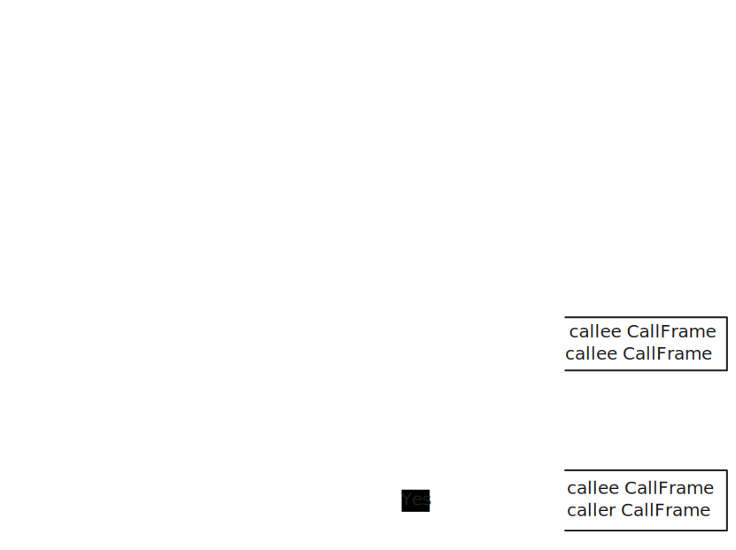
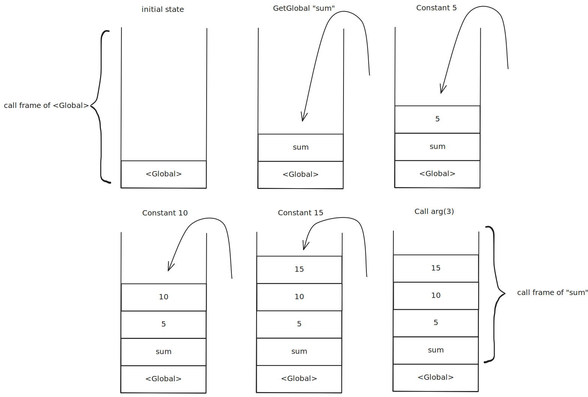

在这一节中，我们将设计并实现函数调用的相关机制。

## 前提

在我们实现的单遍解释器中，我们采用的是线性中间表达，即字节码。

语言运行的整体流程为：源代码 -> 解析器 -> 字节码 -> 虚拟机执行。

## 开始

在解释器中，函数会经历两个阶段：

1. 解析器对函数进行声明、定义、解析为字节码等；
2. 虚拟机在执行过程中遇到函数调用指令时，进行函数调用的相关处理。

了解这两个阶段后，我们可以绘制出函数在解释器的虚拟机中的调用与返回过程：



通过这个图，我们可以了解到函数调用其实本质上是一个状态转换的过程：

在虚拟机中，当遇到函数调用指令时，虚拟机会为其分配一个新的栈帧，这个栈帧包含了函数对象在堆中的引用、局部变量等。当函数执行完成后，虚拟机会退出被调用函数的栈帧，继续执行调用函数的后续指令。

其中相应函数的字节码需要我们提前在解析器阶段生成。

## 解析器生成函数字节码

在解析器阶段，我们需要将函数声明和定义解析为字节码指令，以便虚拟机能够跳转到这个字节码块并进行字节码匹配。

具体而言，我们需要合理利用解析器的上下文成员 `Context` 来存储当前解析的位置（位于哪个函数），并将解析结果写到对应的字节码块中，下面是函数与上下文数据结构：

```rust
struct Function {
    name: String,
    chunk: Vec<u8>,
    /// The number of parameters the function takes.
    arity: u8,
}
struct Context {
    caller: Option<Box<Context>>, 
    current_function: Function,
    scope_depth: usize,
}
```

通过当前上下文，我们就能在解析过程中访问到当前函数的字节码块并写入内部解析得到的结果。

**还有一个问题需要我们解决：函数调用指令的参数传递。**

在函数调用指令中，我们需要将实参传递给被调用函数的形参。

我们可以通过虚拟机的栈来实现参数传递：在调用函数之前，将实参压入栈中，然后在被调用函数的栈帧中访问这些实参。

:::note[]

解析器与虚拟机之间的栈同步机制👉[单遍解释器：局部变量](https://yang-zhihang.github.io/posts/compiler-principles/local_variable/)。

:::

拿具体的代码来说，给出这样一段代码：

```
fun sum(a, b, c) {
  return a + b + c;
}

print sum(5, 10, 15);
```

[笔者实现的解释器](https://github.com/Yang-ZhiHang/rs-lox)给出的反编译结果如下：

```
Disassemble 'sum':
Offset	Line	Opcode
000000	0002	GetLocal	<index 1>
000002	   -	GetLocal	<index 2>
000004	   -	Add
000005	   -	GetLocal	<index 3>
000007	   -	Add
000008	   -	Return
000009	0003	Nil
000010	   -	Return

Disassemble '<Global>':
Offset	Line	Opcode
000000	0003	Closure 	<fn sum>
000002	   -	DefineGlobal	"sum"
000004	0005	GetGlobal	"sum"
000006	   -	Constant	5
000008	   -	Constant	10
000010	   -	Constant	15
000012	   -	Call    	argc(3)
000014	   -	Print
000015	   -	Nil
000016	   -	Return
```

可以看到，在执行 `Call` 指令之前，我们通过三个 `Constant` 指令将实参 `5`、`10` 和 `15` 压入了虚拟机的栈中；在执行 `Call` 指令时，虚拟机会根据参数个数 `argc(3)` 跳到栈顶前三条指令即 `GetGlobal` 来访问函数的字节码并为其生成栈帧。



由于 `sum` 函数的形参也是一种局部变量，因此形参在内部被访问是通过虚拟机的栈偏移量实现的（如 `GetLocal <index 1>` 表示 `sum` 函数栈底往上一个偏移量，即 `5`）。因此，在调用 `sum` 函数时，虚拟机会将该函数的栈指针移动到函数调用所在位置，并通过偏移量来访问实参的值。


> [!TIP]
> 为了简化虚拟机的实现，我们将全局作用域作为一个 `<Global>` 函数来看待。


> [!TIP]
> `<index n>` 表示在当前函数的栈帧中，往上 `n` 个位置的局部变量。第一个局部变量从 `1` 开始计数而不是 `0`，是因为 `0` 的位置通常用来存储函数对象本身，也就是 `self/this`。


## 虚拟机执行函数调用

前面我们大致介绍了虚拟机中函数调用和返回的过程，即创建栈帧与销毁栈帧。

现在我们来看看具体的实现细节：

```rust
let opcode = Self::read_byte(&chunk, pc);
match opcode {
    OpCode::Return => {
        let ret = self.pop();
        self.frame_count -= 1;
        if self.frame_count == 0 {
            self.pop();
            return InterpretResult::Ok;
        }
        // Destory the call frame of callee by fallback stack pointer.
        self.stack_top = slot_offset;
        self.push(ret);
    }
    OpCode::Call => {
        let arg_count = Self::read_byte(&chunk, pc) as usize;
        if !self.call_value(arg_count) {
            return InterpretResult::RuntimeError;
        }
    }
}
```

先来看看创建栈帧的过程：

当虚拟机执行到 `Call` 指令时，首先会读取参数个数 `arg_count`，然后调用 `call_value` 方法来创建新的栈帧。

> [!TIP]
> 在本项目的设计中，参数个数在字节码中紧随 `Call` 指令之后。因此直接读取下一个字节就能得到参数个数。

在 `call_value` 方法中，虚拟机会根据参数个数和当前栈顶位置来计算出新栈帧的起始位置（即 `stack_top - arg_count - 1`），并将函数对象的引用、参数等信息存储在新的栈帧中。

销毁栈帧即将栈帧指针减一，回退到调用函数的栈帧位置（下一次创建新的栈帧会自动覆盖）。如果当前栈帧数量为零了，说明我们已经回退到了全局作用域了，此时直接返回即可。

## 总结

至此，我们完整地走通了从函数声明到虚拟机调用的全过程。

函数调用部分的核心在于管理栈的增长与回退。

不过最核心的难点还是在于思考如何将栈帧的增减与当前单遍解释器进行工程上的关联，即宏观指导到实际落地这中间的过程。