## TileLang

1. `tilelang` 的层次（比较高层的 DSL）
2. `tile` 与 `block` 划分的区别（也就是 `Triton` 与 `TileLang` 的核心区别）
3. 宏观层面的理解：`TileLang` 在整个编译过程中的层次



CUDA、HIP、AscendC 都是编程模型，用于与自家的硬件进行交互。

像 Triton、TileLang 这些语言就是为了不让 Kernel 开发者写多份代码而出现的统一中间件，从 Kernel DSL 到特定的硬件语言我们可以忽略。

## Pytorch FX IR

Pytorch FX IR 是 Pytorch 提供的一种中间表示，用于捕获和表示 PyTorch 模型（`nn.Module`）的计算图结构。它允许开发者在不修改原始模型代码的情况下，对模型进行分析、转换和优化。



Pytorch FX IR 在对图进行分析和优化时，提供了一个灵活的框架，使得开发者可以轻松地实现各种图级别的变换，例如算子融合、量化、内存优化等。

优化后，Pytorch FX IR 仍然会被编译回 Pytorch 模型的形式（`nn.Module`）。

## TVM IR

TVM IR 不止有一个层次，而是有多个层次的 IR，分别对应不同的抽象级别和优化阶段：

1. Relay IR: 这是 TVM 的高层 IR，主要用于表示深度学习模型的计算图结构。可以进行算子融合、图优化等高层次的变换。
2. Tensor IR: 这是 TVM 的中层 IR，主要用于表示张量计算的细节。可以进行内存优化、并行化等中层次的变换。
3. Lowered IR: 这是 TVM 的低层 IR，主要用于表示接近机器码的形式。可以进行寄存器分配、指令选择等低层次的变换。



## 模型文件

模型通常包含：模型结构、模型参数等，而模型的存储格式有很多种，例如 ONNX、TensorFlow 的 `saved_model`、PyTorch 的 `pth` 和 `gguf` 等。

常见的：

1. `pth` 是 PyTorch 的模型文件格式，通常包含模型的权重、结构配置、分词器等信息：

```
model.pth         ← 权重
config.json       ← 结构配置
tokenizer.model   ← 分词器
params.json       ← 参数
```

2. `.safetensors` 是 PyTorch 的安全替代版。`pth` 本质是 pickle 指令序列化，可以存任何指令，而 `.safetensor` 只能存张量；

3. `.gguf` 则是另一种，一个文件搞定所有。llama.cpp 专用，适合本地推理；