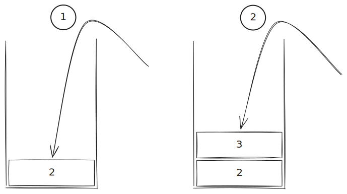

我们在实现一门编程语言时，不可避免需要涉及到变量的全局性和局部性。

1. 全局变量在任何作用域均能被访问；
2. 局部变量只能在所在作用域内被访问。

对于全局变量，我们通常使用哈希表数据结构创建一个符号表进行存储。

在 clox 单遍解释器中，局部变量的存储使用数组结构模拟栈帧，而非级别更小的符号表。

:::note[为什么使用数组而不是哈希表？]

这就要讲到变量访问的局部性了。

局部变量的访问具有很强的局部性：在一个函数调用期间，访问的变量通常集中在函数的参数和局部变量上，而不是全局变量。

而哈希表正好有个缺点：内容分散、不连续，这会导致 CPU 缓存命中率下降，进而影响性能。

栈帧这一结构中，同一作用域内的变量存储在连续、相邻的内存位置上，这使得 CPU 缓存能够更高效地访问这些变量，从而提升性能。

这是从内存分布的角度来讲的，当然还有其他方面的考虑，比如代码翻译为汇编后的指令数量等，不再展开。

:::

## 结合具体情景来理解

现在我们来看这段代码（暂且不关心语法）：

```rust
let a = 1;
{
    let b = 2;
    {
        let c = 3;
        print c;
    }
}
```


:::note[代码解读]

在 `a` 变量的声明和值绑定后，`a` 及其值将会被保存到全局符号表当中。在随后的代码块内，`b` 和 `c` 变量在不同作用域内被依次声明了。

:::

当解析器进入到第一个 `{` 时，说明我们进入了一个局部作用域，我们会使用栈帧来存储这个作用域内的局部变量。这个栈帧由解析器来维护，栈帧元素包含了名称、作用域深度等。

后面即使进入了第二个 `{`，我们也会继续使用同一个栈帧来存储局部变量，因为前面的局部变量生命周期还没有结束。



在前端解析到 `print c` 时，前端的解析器会从栈顶开始向下查找，直到找到 `c` 变量在栈帧中的索引。随后将这个索引信息写入字节码中（后续要给虚拟机执行的字节码），因此最后编译到字节码的内容只有操作码和索引，没有局部变量的名称信息。

前端解析结束后，产出字节码。虚拟机在字节码相应部分拿到的是一个指令：`GET_LOCAL 1`，它的语义是：从当前栈帧（虚拟机维护的栈帧）中获取索引为 `1` 的局部变量的值并压入栈顶；随后 `PRINT` 指令将这个值打印出来。

当解析器进入到 `}` 时，说明我们离开了一个局部作用域，届时我们会将这个作用域内的局部变量从栈帧中弹出（通过检查元素的作用域深度实现）。

> [!TIP]
>
> 这里的设计非常巧妙。
>
> 解释器的栈帧与虚拟机的栈帧共用了同一个索引，这是因为它们在同一作用域内维护的局部变量是相同的。
>
> 前端解析器在解析过程中为每个局部变量分配一个索引，并将这个索引写入字节码中；虚拟机在执行字节码时使用这个索引来访问栈帧中的局部变量。就相当于解释器提前为虚拟机预先计算好了局部变量在栈帧中的位置，这样虚拟机在执行时就不需要再进行一次哈希表查找来获取变量的值了。
>
> 不过这种设计也带来了一个限制，即代码块无法写在表达式内，比如：
> 
> ```rust
> 1 + 2 + {
>     let a = 3;
>     a * 4
> }
> ```
>
> 因为虚拟机维护的栈帧同时也需要临时存放表达式计算的中间结果，而解释器维护的栈帧只存放局部变量，如果代码块写在表达式内，就会导致两者的栈帧索引无法同步，无法正确访问局部变量。

总结就是通过栈帧来存储局部变量，并通过索引来访问它们，这样就避免了使用哈希表带来的性能问题。

想看源代码的话，欢迎参考我的 Github 仓库：

::github{repo="yang-zhihang/rs-lox"}
