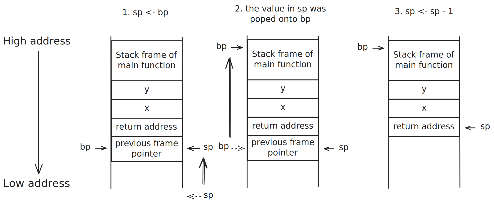

少年，不知你是否想过这样一个问题：进程在内存中是如何分布的呢？

本文将以 C 语言程序为例，对进程在内存中的分布情况以及函数调用进行简要介绍。文中的例子使用 64 位架构进行说明（即一个寄存器大小为 64 位）。

# 进程的内存分布

以 C 语言编写的程序为例，程序在运行时会被加载到内存中，并划分为五个不同的区域，从低地址往高地址依次是：

1. **代码段（Text Segment/Code Segment）**：存放程序的机器代码，即编译后的指令。
2. **数据段（Data Segment）**：存放已初始化的全局变量和静态变量。
3. **BSS 段（Block Started by Symbol Segment）**：存放未初始化的全局变量和静态变量。
4. **堆（Heap）**：用于动态内存分配，由程序在运行时通过函数如 `malloc` 和 `free` 来管理。
5. **栈（Stack）**：用于存放函数调用时的局部变量、函数参数和返回地址等。

:::note[变量为什么会被分为数据段和 BSS 段，而不是放在一块？]

答：方便内存管理和节省存储空间。

有了 BSS 段，程序在加载时不需要为未初始化的变量分配实际的存储空间，而是只需记录其大小即可，从而节省了存储空间和加载时间。比如：

```c
int a[1000];
int b[1000] = {1, 2, 3};
```

变量 `a` 在可执行程序（如 `.exe`）中不会占用实际的存储空间（8KB），而是只记录其大小为 8KB，程序加载到内存时由操作系统分配实际的存储空间，即分配在 BSS 段；变量 `b` 则会在可执行程序中占用实际的存储空间（8KB），并初始化为指定的值。

:::

# 栈与函数调用

栈是一种后进先出（LIFO, Last In First Out）的数据结构，主要用于管理函数调用和局部变量。每当一个函数被调用时，系统会为该函数创建一个**栈帧（Stack Frame）**，用于存储该函数的局部变量、参数和返回地址等信息。

函数调用是对可复用代码块的执行请求。当一个函数被调用时，程序会跳转到该函数的代码段，并在栈上创建一个新的栈帧。函数执行完毕后，栈帧会被销毁，程序返回到调用该函数的位置。

以 **C 语言调用约定（C Declaration）** 为例，函数调用过程中栈的分布大致如图所示：


1. **函数调用前**：栈中存储着调用者的栈帧 **stack frame of caller**。
2. **函数调用时**：为被调用函数创建一个新的栈帧 **stack frame of callee**，并将其压入栈顶。调用者保存被调用者需要使用的参数列表；被调用者保存调用者的返回地址、调用者栈帧基址指针 **previous stack pointer** 和需要维护的寄存器。
3. **函数执行完毕**：被调用函数返回结果，销毁其栈帧，程序返回到调用者继续执行。

为了更加具体地说明，下面我们以 C 语言为例。考虑以下代码：

```c
int add(int x, int y) {
    int sum = x + y;
    return sum;
}

int main() {
    int a = 5;
    int b = 10;
    int result = add(a, b);
    return 0;
}
```

当 `main` 函数调用 `add` 函数时，栈的变化如下：


1. **调用 `add` 函数**：为 `add` 函数创建栈帧，存储参数 `x` 和 `y` 以及局部变量 `sum`。
2. **函数执行完毕**：`add` 函数返回结果，栈帧被销毁，程序返回到 `main` 函数继续执行。

为了方便理解函数调用过程中栈的变化，我们可以使用汇编代码来表示 `main` 函数调用 `add` 函数的过程：

```asm
main proc
    ...
    push b
    push a
    call add
    add  sp, 16
    ...
main endp

add proc
    push bp
    mov  bp, sp
    ...
    mov  sp, bp
    pop  bp
    ret
add endp

ends main
```

接下来我们详细解释一下上面这些汇编代码。

首先，在 `main` 函数调用 `add` 函数前，`main` 函数需要将 `add` 函数需要的参数 `x` 和 `y` 压入栈中，然后跳转到 `add` 函数的代码段执行：

```asm
push b
push a
call add
```

:::note[为什么先 push b 而不是 a 呢？]

在 C 语言的调用约定中，函数参数通常是参数列表从右到左压入栈中的。这种调用约定能够使被调用者以更加容易理解的方式访问这些参数：

```asm
mov  ax, [bp + 24] ; 访问参数 y
mov  ax, [bp + 16] ; 访问参数 x
```

`bp` 即当前的基址指针 **current frame pointer**，`bp + 16` 和 `bp + 24` 分别对应栈帧中参数 `x` 和 `y` 的位置。即，参数从右到左入栈能够让被调用者以地址递增的方式从左到右访问参数列表。

:::

进入 `add` 函数后，函数会为其创建一个新的栈帧，并将调用者的栈帧基址指针保存起来：

```asm
push bp            ; 保存调用者的栈帧基址指针
mov  bp, sp        ; 设置当前栈帧的基址指针
```


经过寄存器的一通计算后，`add` 函数执行完毕，并恢复调用者的栈帧基址指针：

```asm
mov  sp, bp        ; 恢复栈指针
pop  bp            ; 恢复调用者的栈帧基址指针
```




:::note[bp 的内容不是 prev fp 吗，为什么 sp 的指向和 bp 相同？]

这里注意不要混淆了，前面我们将 `bp` 保存到了栈中，然后将 `sp` 的值赋给了 `bp`。所以，此时 `bp` 的内容是当前栈帧的基址位置，只不过这个位置存放着调用者的栈帧基址指针而已。

:::


在执行最后的 `ret` 指令时，`sp` 指向的地址即为调用者的返回地址，程序跳转回 `main` 函数继续执行对被调用者参数的清理工作：

```asm
add sp, 16        ; 清理栈上的参数
```


> [!TIP]
> `ret` 相当于 `pop ip` + `jmp ip`，即将栈顶的返回地址弹出到指令指针寄存器 `ip` 中，然后跳转到该地址继续执行；
> 同理，前面的 `call add` 相当于 `push ip` + `jmp add`，即将下一条指令的地址压入栈中，然后跳转到 `add` 函数执行。


至此，函数调用过程结束，栈恢复到调用前的状态。以上就是栈与函数调用的基本原理和过程。

如果您有文章内容改进建议或勘误，非常欢迎联系 zamyang@qq.com !