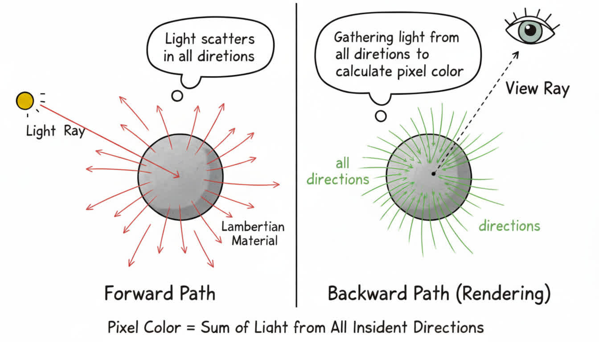
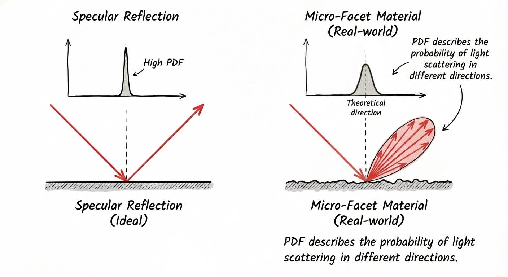

本篇笔记我们将从概念、应用和原理三个方面来理解 PDF（概率密度函数）。

## PDF 是什么？

PDF 的英文全拼是 Probability Density Function，意思为概率密度函数。PDF 涉及概率论里面的知识，也就是和统计学相关。

之所以叫概率密度函数，是因为它描述了概率在一个空间上分布的情况。

举一个很形象的例子，假设说我们现在知道了一个物体的体积以及它的密度，那么我们就可以根据体积和密度求出这个物体的重量。

如果说这个物体的密度是常数，那么直接将密度与体积相乘就能够得到重量；但是如果说这个密度是一个函数，物体内的密度并不均匀，但是可以通过这个函数来描述，那么我们对其在空间内进行积分就能求出物体的重量。

概率密度函数的「密度」一词就是这么来的。它可以为常数，也可以是函数。如果说我们要求出一个空间范围内的概率，那么我们就需要知道空间与概率密度信息。如果说这个概率密度是一个常数，那么直接将概率密度与空间范围相乘就能够得到概率。但是如果说这个概率密度是一个函数，那我们就需要对其进行积分。

> [!TIP]
> PDF 与密度唯一的区别在于，PDF 要求在空间定义域的积分结果为 1。也就是空间定义域内概率总和为 1，这个很好理解。

如果理解起来可能有点绕，[Ray Tracing The Rest of Your Life - Constructing a PDF](https://raytracing.github.io/books/RayTracingTheRestOfYourLife.html#onedimensionalmontecarlointegration/constructingapdf) 提供了图文并茂的解释，感兴趣的读者可以前往查看。

## PDF 有什么用？

对于 PDF 有什么用这个问题，我们最好结合当下要去解决的问题，或者要学习的内容去了解。比如说，笔者最近正在学习路径追踪中 [Monte Carlo](https://yang-zhihang.github.io/posts/computer-graphics/monte-carlo/) 积分那一块的内容，那么笔者就应该结合这部分去了解 PDF 在其中扮演了一个怎样的角色。

在路径追踪中，光线的传播是随机的。

举个例子，假设我们现在要将光线打到 Lambert 材质的物体上，那么光线打到这个物体表面之后会发生漫反射。也就是光线会向四面八方散射出去。

同样的道理，如果说我们想要渲染出这个 Lambert 材质物体上某个点的像素值，也就是从这个点反射到我们眼睛这个方向的光线的颜色。那么，我们就需要获取「来自四面八方的、打到这个点上最后反射到我们眼睛里的」光线的颜色。

由于光线来自四面八方，所以说我们要对四面八方的光线进行采样。采样的次数我们可以规定好（采样次数是有穷的，所以我们才要使用 Monte Carlo 随机采样通过较少的采样次数逼近真实值），但是采样的结果需要我们通过 PDF 加权修正算出来。

:::note[为什么要使用 PDF 加权修正？]

光线在微表面下遵从这个事实：光线反射时，镜面反射方向周围的散射光线较多；而掠射角方向的散射光线较少。

因此在工程上，我们需要对光进行多重重要性采样（Multiple Importance Sampling）。即，在散射光线较多的方向多采样；在掠射角方向少采样。同时，为了保证结果的无偏性，多采样的方向要除以 PDF 值来减少它的权重；少采样的方向要除以 PDF 值来增加它的权重。

读起来很反直觉对吧，“我都对重要方向多采样了，为什么还要通过 PDF 降低权重呢？？这不相当于啥也没干嘛”。

其实最佳的理解方式莫过于实践，通过实践你会发现：

1. 如果不进行权重修正，画面会过暗；
2. 如果不对光进行 MIS，画面会充满噪点（有光源的黑暗环境）。

:::

对于不同材质的物体来说，你并不能规定一个光线打到这个点之后，它一定会发生镜面反射或者是折射。我们只能说他们反射或者折射的方向大致是理论计算出来的那个方向。用 PDF 来表示就是：理论反射方向的概率密度较大，其他方向（比如掠射角）概率密度较小。

## PDF 在 Monte Carlo 中的作用原理

前面我们说到，我们并不能模拟光在真实世界中的反弹数量与采样数量。所以说，我们需要通过蒙特卡洛随机采样来获取到真实的像素值。

在工程上，我们期望有这么一个函数 $f(x)$：

1. 这个函数的定义域为 `[0, 1)` 的随机值（均匀随机数）；
2. 值域为 PDF 的定义域；
3. 在通过多轮随机值输入后，$f(x)$ 的直方图分布能够符合 PDF 曲线。

> [!TIP]
> 为什么偏偏是 `[0, 1)`？是因为上帝喜欢这个区间吗？不，其实是因为这是计算机最基础的随机源。

这涉及到了 Monte Carlo 采样中的一个重要概念：逆变换采样（Inverse Transform Sampling）。通过逆变换采样，我们可以将均匀分布的随机数转换为符合我们需要的 PDF 分布的随机数。

此处我们只讲述大致的步骤。

1. 我们需要知道概率密度函数与空间之间的关系。比如说我们现在要求解一个光线打到表面上时，反射光线在半球表面的分布。根据 Lambert's Cosine Law，我们设 $PDF=C \cdot cos\theta$。这个系数是为了让 PDF 在这个空间的积分结果为 1。通过这一点我们就可以求出 PDF 的解析式了；

2. 对 PDF 进行积分求出 CDF。CDF 本质上建立了从样本空间（如角度）到 `[0, 1)` 区间的映射关系。

3. 对 CDF 求逆函数，得到从 `[0, 1)` 区间到样本空间的映射。最后我们就可以通过「计算机极易实现的伪随机数生成器」来生成一个符合 PDF 分布的随机样本。

通过上述步骤，我们就可以实现从 `[0, 1)` 均匀分布到 PDF 分布的采样过程，从而在路径追踪中对光线进行有效的采样与加权修正，使渲染结果更加逼真。而 PDF 在这个过程中为 Monte Carlo 算法提供了先验分布的采样依据。

---

以上，是笔者在学习路径追踪过程中的一些理解，如有勘误，欢迎将问题发送至 zamyang@qq.com！

绘图工具：Nano Banana, Photoshop

:::note[题外话]

总结一下最近学习图形学的近况。通过手搓光追渲染器，大致了解了图形学的一些基本概念。

起初，你会接触到立体几何、向量运算、光线与几何体的求交算法；

接着，你会学习到光的传播模型、材质模型、采样与积分；

最后你会发现，程序模拟不了上帝逆天的光采样数量。于是我们只能退而求其次，使用概率和统计的方法来逼近真实的光线传播过程。

Ray Tracing in One Weekend 系列第三部的 Title 很形象：The Rest of Your Life，内容讲的就是光采样。后续无数伟人在这条路上继续探索，都是为了使用更加高效的采样方法，更快更真实地逼近光线传播过程。

所以就有了这么一句话：光线追踪是未来的技术。

:::
