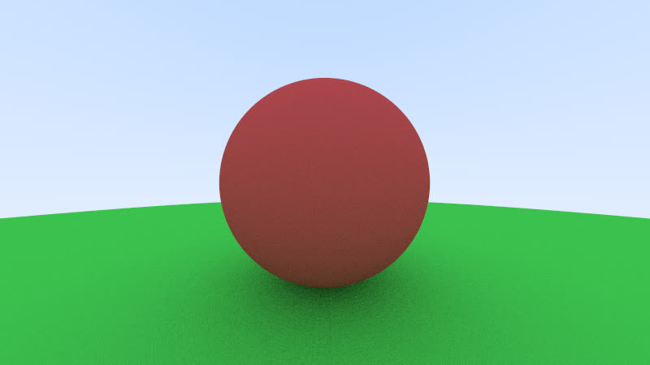
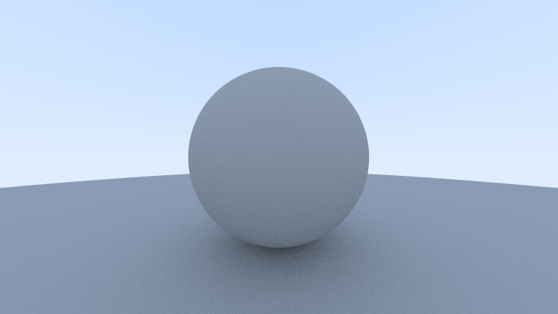

最近结识了一位对图形学颇感兴趣的 Friend，在他的影响下，我也开始尝试学习图形学相关的知识：拜读 [Ray Tracing in One Weekend Series](https://raytracing.github.io/)。

## 问题重述

在 Week One 的收尾工作时，笔者遇到了一个比较疑惑的问题：在给以巨大球体为基础的地面进行渲染后，得到的地面出现了类似摩尔纹的环状图案，如封面所示。不过原本的环形纹路并不是很明显，封面中的纹路是笔者在后来理解了问题产生的原理之后，对其进行了放大处理。

## 问题分析


:::note[为什么在 Week One 的收尾工作的时候才发现这个问题？]

因为在之前的场景渲染中，为了美观，笔者使用的是带有颜色的地面材质，而这种材质不得不说不细看还真看不出来。

:::



这种环状阴影的出现，主要源于精度问题。由于球体较大，每位移一处，变化的坐标值较小，要求的存储精度较高。而我在实现路径追踪时，使用的是 `f32` 类型来存储坐标值，因为这是对内存和精度的权衡。虽然大部分场景已经能够满足，但在巨大球体的地面上，`f32` 的精度已经不足以满足需求。

在精度不足的情况下，如果我们还将求交时的 `t_min` 设置为 0 或者太接近于 0 的数值，那么就会导致程序在采样反射光线时，直接判定反射光线与球体相交，渲染采样就会额外增加一层递归，衰减系数变为原来的一倍，从而使颜色变深。

下面笔者给大家进行分析，以下是光线求交的主要代码片段：

```rust title="renderer.rs"
pub fn trace_ray(r: &Ray, s: &Scene, depth: u32, rec: &mut HitRecord) -> Color {
    // ...
    if s.get_closest_intersect(r, 1e-5, f32::INFINITY, rec) {
        let mut attenuation = Color::default();
        let mut scatter = Ray::default();
        if rec.material.as_ref().unwrap()
            .scatter(r, rec, &mut attenuation, &mut scatter)
        {
            return attenuation * Self::trace_ray(&scatter, s, depth - 1, rec);
        }
        return Color::black();
    }
    // ...
```

在光线求交的范围限定下界 `t_min` 处，我们使用了 `1e-5` 作为最小值，这个值对于大部分场景来说是足够的，但对于巨大球体的地面来说，仍然不够。

当程序第一次采样反射光线时，程序正常求交，进入这一行代码进行反射光线的采样：

```rust title="renderer.rs/trace_ray"
return attenuation * Self::trace_ray(&scatter, s, depth - 1, rec);
```

当程序第二次采样反射光线时，由于反射光线的起点非常接近球体表面（因为球体很大，坐标值变化很小），导致 `get_closest_intersect` 函数判定反射光线与球体相交，多进行了一次光线采样。

最后，我们得到的光线结果就是 `attenuation * attenuation * Color`，而我们原本预期的结果应该是 `attenuation * Color`，也就是只衰减一次。既然多了一次衰减，颜色自然就变深了。

## 解决方案

通过上面的分析，我们可以得出两种解决方案：

1. 提高存储坐标值的精度，使用 `f64` 类型来存储坐标值。不过这种方法会增加内存开销，增加渲染时间。
2. 在求交时，将 `t_min` 从 `1e-5` 改为一个较大的数值，例如 `0.001`，以避免反射光线与球体的误判交点。

笔者选择了第二种方法进行解决。经过调整代码后，渲染结果如下所示：


