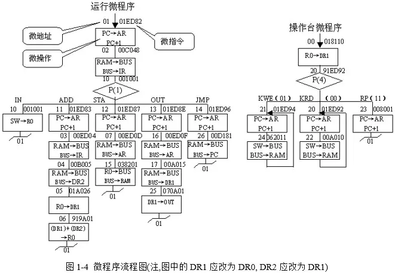
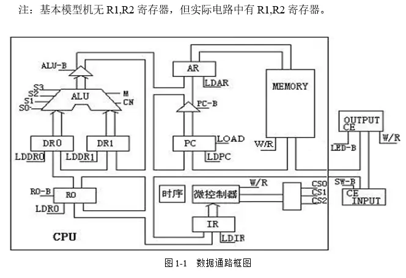
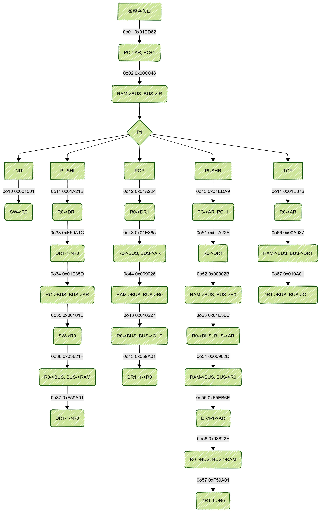

# 实验目的

最重要的，咱先来确定一下实验的目标和思路。

本次计组实验课设要求我们设计并实现一个微程序，即在 `ROM` 中存储一系列微指令，完成某些我们自定义的功能。

其次是思路，实验手册中给的微指令有 24 位，每一位都是有用的，咱们需要弄清楚每一位的作用，才能设计出符合要求的微程序。

24..21|20|19|18|17 16|15..13|12..10|9..6|5..0
------|--|--|--|-----|------|------|----|----
S[3..0]|M|Cn|WE|A9 A8|  A   |  B   | C  | uA 

高 6 位主要是和 ALU 的操作相关：

S       | M=0 (Mathmatical)                          | M=1 (Logical)
--------|--------------------------------------------|----------------------------
0000    | $A + CN$                                   | $\overline{A}$
0001    | $(A \lor B) + CN$                          | $\overline{(A \lor B)}$
0010    | $(A \lor \overline{B}) + CN$               | $(\overline{A}) \land B$
0011    | $0 - CN$                                   | $0$
0100    | $A + (A \land \overline{B}) + CN$          | $\overline{(A \land B)}$
0101    | $(A \lor B) + (A \land \overline{B}) + CN$ | $\overline{B}$
0110    | $A - B - CN$                               | $A \oplus B$
0111    | $(A \land \overline{B}) - CN$              | $A \land \overline{B}$
1000    | $A + (A \land B) + CN$                     | $(\overline{A}) \lor B$
1001    | $A + B + CN$                               | $\overline{(A \oplus B)}$
1010    | $(A \lor \overline{B}) + (A \land B) + CN$ | $B$
1011    | $(A \land B) - CN$                         | $A \land B$
1100    | $A + A + CN$                               | $1$
1101    | $(A \lor B) + A + CN$                      | $A \lor \overline{B}$
1110    | $(A \lor \overline{B}) + A + CN$           | $A \lor B$
1111    | $A - CN$                                   | $A$

# 最简单的开始

就拿 `R0->DR1` 这个微操作举例，上学期我们都学过计组，那么我们就知道这个微操作的微命令应该是 `R0out` 和 `DR1in`。

而当我们去查看实验操作手册里面的说明可以发现，ABC 字段的作用已经给你了，我们只需要进行相应的解析，然后就能得到下面这张表：

> `nop` 是无操作

| A(15..13) | Func   | description  | B(12..10) | Func   | description     | C(9..7) | Func   |
|-----------|--------|--------------|-----------|--------|-----------------|---------|--------|
| 0 0 0     | nop    |              | 0 0 0     | nop    |                 | 0 0 0   | nop    |
| 0 0 1     | LDRi   | BUS->Ri      | 0 0 1     | RS-B   | Rs->BUS         | 0 0 1   | P(1)   |
| 0 1 0     | LDDR1  | BUS->DR1     | 0 1 0     | RD-B   | Rd->BUS         | 0 1 0   |        |
| 0 1 1     | LDDR2  | BUS->DR2     | 0 1 1     |        |                 | 0 1 1   |        |
| 1 0 0     | LDIR   | BUS->IR      | 1 0 0     |        |                 | 1 0 0   | P(4)   |
| 1 0 1     | LOAD   |              | 1 0 1     | ALU-B  | ALU->BUS        | 1 0 1   | LDAR   |
| 1 1 0     | LDAR   | BUS->AR      | 1 1 0     | PC-B   | PC->BUS         | 1 1 0   | LDPC   |

还有 `A9A8` 对应的操作：

| A9 A8    | Func  | description  |
|----------|-------|--------------|
| 0 0      | SW-B  | SW->BUS      |
| 0 1      | RAM-B | RAM->BUS     |
| 1 0      | OUT-B | OUT->BUS     |
| 1 1      | nop   |              |

显而易见，`R0out` 对应 `RS-B`, `DR1in` 对应 `LDDR1`，C 字段没有我们需要的操作，那么我们就确定了微指令的 ABC 字段。

又因为我们当前的操作不需要 `ALU` 和外部 `IO`，所以 `ALU` 相关的操作置 0, `A9A8` 置 1即可。

最后就能得出 `R0->DR1` 操作除去微地址的微指令为 `0000 0001 1010 0010 00`

# 正式开始

我们先来看一下实验手册中给出的微指令流程图：

可以看到左侧的 `运行微程序` 部分当中，指令会先被送入 `IR` 指令寄存器，然后进行解析得出 `P[1]` 信号，根据 `P[1]` 电路可以判断指令应该跳到地址进行下一步数据的读取。

数据的读取需要依靠 `AR` 地址寄存器指定数据在 `RAM` 中的位置，而 `AR` 的值则是由 `PC` 程序计数器提供的，`PC` 的值会在每次时钟上升沿时加 1（C 字段必须是 101, PC 才会自增），从而实现顺序读取指令。

因此如果我们要设计 `ADD` 这种指令，我们需要知道它在基本模型机当中要执行的微操作有哪些，以微程序流程图中的 `ADD` 指令为例：

1. `01ED83` 取地址：`PC -> AR`，`PC + 1 -> PC`
2. `00E004` 读数据的地址：`RAM[AR] -> AR`
3. `00B005` 读数据：`RAM[AR] -> DR2`
4. `01A206` 读寄存器数据：`R0 -> DR1`
5. `919A01` 做加法：`DR1 + DR2 -> R0`

> 你没看错，是 `00E004` 而不是 `00ED04`；`01A206` 也一样，手册有错误，注意甄别~

这些微操作我们通过数据通路框图来推理：

`ADD` 指令需要 5 条微指令来完成，概括就是取值+操作。

而我在本次课程设计中实现的是栈的基本操作：栈初始化 `INIT`、入栈 `PUSH` 、出栈 `POP`以及查看栈顶元素 `TOP`，思路和 `ADD` 指令类似。

# PUSH

入栈操作用 C 语言描述的话就是：`array[--top] = value`

> 这里 `--top` 是因为栈顶指针是从高地址向低地址增长的。

所以 `PUSHI` 指令的微操作大概可以描述为：

1. 保存栈顶指针
2. 将输入的值存入 `RAM[栈顶指针]`
3. 更新栈顶指针

> 在 `PUSH` 操作之前需要先确定栈顶指针的初始值

栈顶指针可以保存在 `R0` 中，后续通过 `DR1` 进行类似保护现场的操作。

所以，`PUSH` 指令的微操作可以设计为：

1. 临时保存栈顶指针：`R0 -> DR1`
2. 保存输入值：`DR1-1 -> AR, [获取需要的数据 -> R0], R0 -> RAM[AR]`
3. 更新栈顶指针：`DR1-1 -> R0`

`PUSH` 指令获取数据的方式可以有两种：

1. 实验箱手动输入值
2. 将 `RAM` 中的值寻址入栈

了解了 `PUSH` 指令的微操作框架之后，后续的指令微操作就很好设计了，也是类似的。

下面是我的计组课设流程图，仅供参考：

绘图工具: `mermaid`
