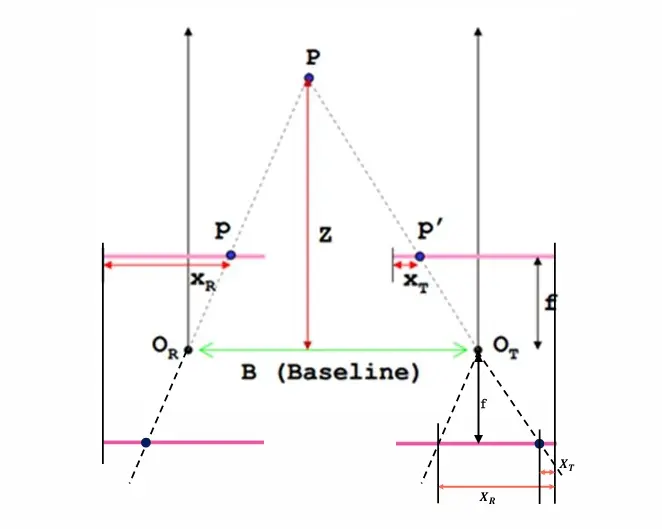
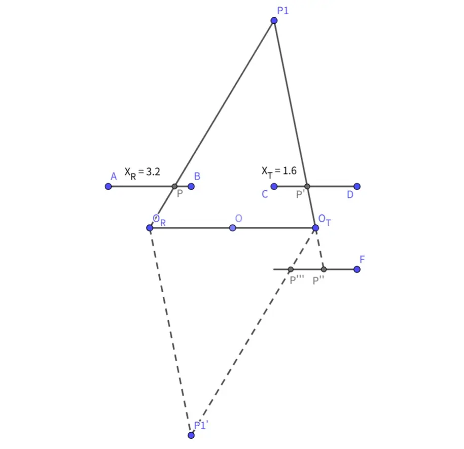

不得不说，期末周复习 PPT 的时候看到 "根据...可得" 或者 "显然" 这种措辞就很无奈，倒是把过程写出来呀（晕）

本文将证明双目测深度的计算公式：$Z = \frac{f \cdot B}{X_R - X_T}$

## 题目

如图，$P$ 是待测物体上的某一点，$O_R$ 与 $O_T$ 分别是两个相机的光心，点 $P$ 在两个相机感光器上的成像点分别为 $P$ 和 $P^\prime$，$f$ 为相机焦距，$B$ 为两相机中心距，$Z$ 为所求深度信息。

相似三角形大家肯定都懂，但是右下角那段线段的长度为什么是 $X_R$ 呢?

## 证明

其实很简单，只要我们将整个图像以点 $O$ 的中心对称图画出来就行了，如下图所示：

现在我们可以很直观地看到 $P^{\prime\prime\prime}F = AP = X_R$

又由于 $P^{\prime\prime}$ 是 $P^{\prime}$ 连接 $O_T$ 的延长线与成像平面的交点

所以 $P^{\prime\prime}$ 与 $P^{\prime}$ 中心对称，那么就有 $P^{\prime\prime}F = CP^{\prime} = X_T$

从而 $P^{\prime\prime\prime}P^{\prime\prime} = X_R - X_T$

最后才有所谓的三角形相似定理：$\frac{O_RO_T}{X_R - X_T} = \frac{Z}{f}$，其中 $O_RO_T=B$

得 $Z = \frac{f \cdot B}{X_R - X_T}$

证毕。