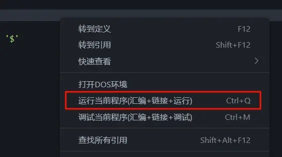

**前情提要**: 国庆前，咱的微机原理第一次实验就这么水灵灵地布置了，Teacher 要求我们对第三章后面的几道题进行实操。

打开课程资料一看，这么多的文件，不知从哪下手：

由于咱们的电脑基本都是 64 位，但是 8086 的实验环境需要 16 位，所以资料给我们提供了 DOS-BOX 这个虚拟磁盘系统。

简单地阅读了一下说明文档，大致了解了我们需要做的事情：

1. 安装 DOS-BOX 到自己的电脑上（D盘）
2. 配置 VSCode 或者 Visual Studio（二选一，推荐 VSCode）
3. 编写 .asm 汇编代码并在 DOS-BOX 中运行

## 安装 DOS-BOX

这一步我们直接解压 `DOS-BOX.rar` 然后根据里面的 `Install_Help.txt` 进行安装即可。

## 配置 VSCode

VSCode 的配置相对来说比较简单，咱们只需要安装 `MASM/TASM` 这个插件：

接着是一些必要的基础配置，点击 VSCode 左下角选择我们之前安装的 `DOS-BOX` 虚拟环境：

## 在 DOS-BOX 中运行汇编代码

随便创建一个 `.asm` 看看能不能跑（内容让 ai 编一个，比如输出 HelloWorld），右键创建好的 `.asm` 文件，选择 `Run ASM Code`（甚至可以自己定义个快捷键）：

运行之后的结果是这样的：

